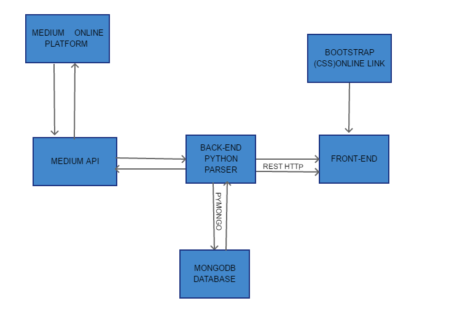
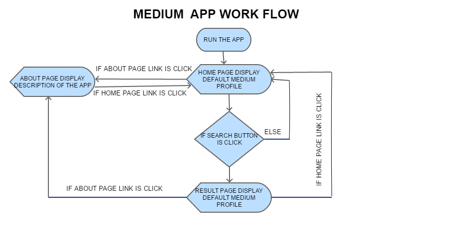
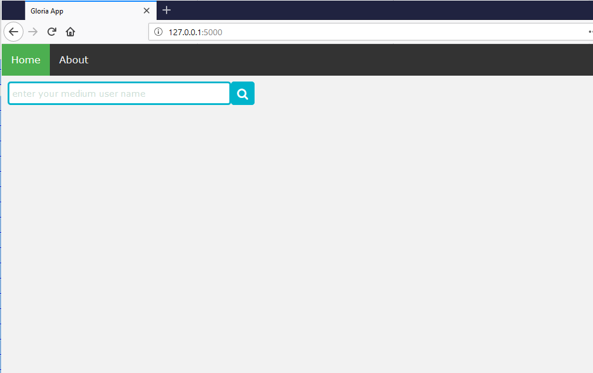
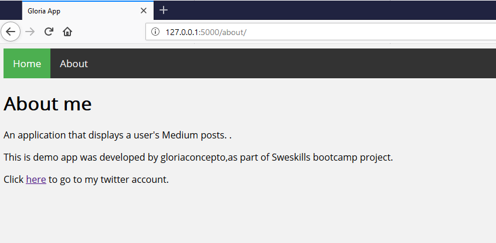
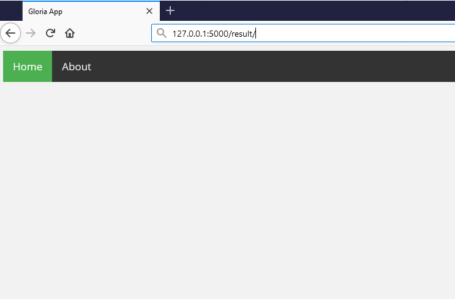

# PROJECT TITLE:  MEDIUM PUBLICATIONS

## PROJECT DESCRIPTION:
An application that displays a user's Medium posts.On submission the app will display
the following:
1) The user's name

2) The user's avatar/image if available.

3)Number of publications subscribe by the user
 
4) Links to user's 5 recent posts.

5)The tags each post has.

Trello Project Link:https://trello.com/b/HIH0JJck/medium-publication-app

##SET UP:
 
### Programming Language:
               
               Python 3.7.o

### Programming Ide:

       pyscripter,Atom

### Frameworks:
          
          Flask8,monogdb,

### Python tools/Libraries: 

         python-virtual,flask-wtf,mysql.connector,requests

### Markup Languages: 
             
             JSON,HTTP,HTML5,CSS

## APPLICATION ARCHITECTURE

## APPLICATION WORK FLOW

## APPLICATION HOME PAGE

## APPLICATION ABOUT PAGE

## APPLICATION RESULT PAGE

